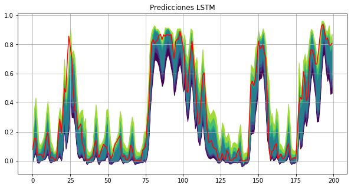

# wind-production-prediction
Wind energy production prediction in Cádiz.

##  Abstract
Unlike point forecasts, probabilistic forecasting improves decision making by measuring the uncertainty of the forecasts.  
In this study, we make probabilistic predictions using quantiles prediction and prediction intervals for wind energy production in Cádiz during 2015-2018. 
To make these predictions we will be using different linear and non-linear models (MLPs and LSTMs) which are later compared in order to determine which of them is the best fit for the problem.

## Quantile predictions on the test set with the best model (LSTM)
